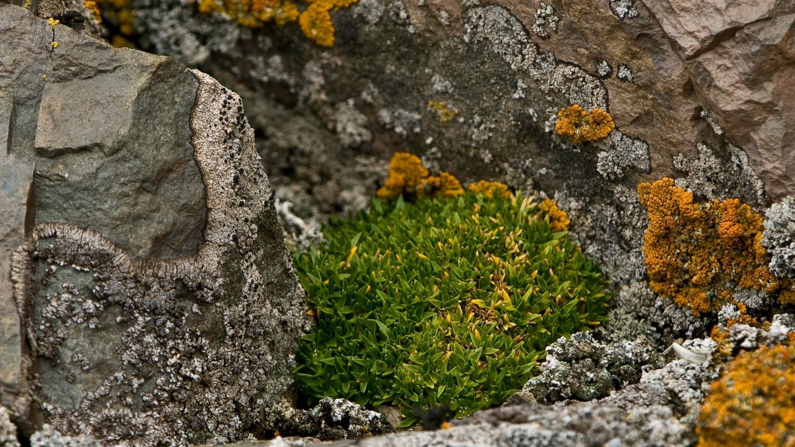

# Data set: Antarctic Plant Database
## Database: Antarctic Biodiversity Information Facility
## Descriptive Analysis for the AMEA by data scientists team

## 🔎 Description 

Is a database of the plant collections held in the British Antarctic Survey's herbarium (international code AAS). This contains over 40 000 plant specimens from Antarctica, the sub-Antarctic Islands and surrounding continents (especially Fuegia and Patagonia). Over 2000 species are represented, comprising predominantly mosses, liverworts and lichens with smaller collections of vascular plants, macro-algae and macro-fungi.

## Citation

[British Antarctic Survey. ANTARCTIC PLANT DATABASE. Occurrence Dataset](https://doi.org/10.15468/6dgnjf)

## ⚙️ Objective
To describe the dataset with the main statistics, in order to make the information of these observations accesible to all the interested public

---

## 🔧 Process

An analysis of the dataset was performed using the Python language, following this process:

1. Data set exploration
2. Data analysis
3. Creation of visualizations

---
## 💿 Final Output
